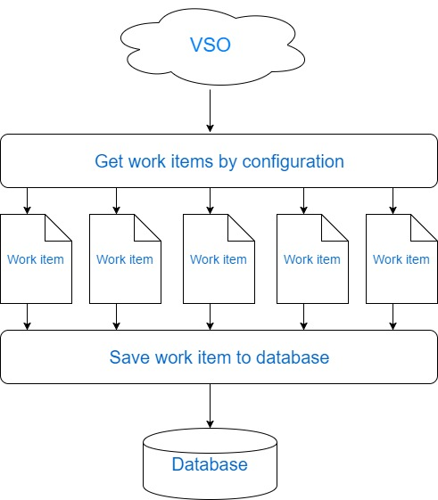

## Location 
\\skypeintl\SkypeIntlTools\ClientTools\Desktop\Console\ExtensibleVSOAPI 
 
## Files
* `MixPanelDataExtraction.Api`
    
    This is a common library that includes features can be used in any project not only in ExtensibleVSOAPI.

* `Config.xml`
    
    this is a global configuration file that is used to configure JsonEndPoint, Dll file name, class name and class parameters, Json Field Name and Sql Column Name Mapping, Sql table name,etc.

* `ExtensibleVSOAPI.Lib.exe`

    Entry point of the tool.

## Installation Instruction
Before execute the tool, go over the `Config.xml` to make sure the only two configurable options are correct. One of them is `SqlTableName` which has default value of `CountryLanguageCount`, another one is `Type` which has three possible values such as `Task`, `Epic` and `Enabling Specification`.Now its ready to click `ExtensibleVSOAPI.Lib.exe` file to execute the tool.

## Summary
This tool allows user to get VSO work items by configurations that are specified in `Config.xml` and save them into database. 

## Description

### Work Flow
* `Retrieve work item data`

    Retrieve all work items by `Type` and `FromDate` conditions that are specified in `CustomLib` section of `Config.xml`.

* `Parse work item data`

    Get work items that matches the `ResultTemplate` and `ResultItemTemplate` conditions that are specified  in `JsonEndPoint` section of `Config.xml`.

* `Save work item data to database`

    Save the work items that matches mapping conditions in `Mapping` section such as `JsonFieldName` and `SqlColumnName`

Diagram simply illustrates the work flow below:

### The configuration overview of Endpoints and Mapping

* `JsonEndPoint`

    `JsonEndPoint` includes sections such as `CustomLib`,`ResultTemplate` and `ResultItemTemplate`. `CustomLib` includes `DllName` which is name of dll file that would be referenced, `FetchClass` which is the class used to get VSO work items, `FetchParams` which are params that would be the condition of retrieving data function. `ResultTemplate` and `ResultItemTemplate` are templates that is used to get certain sections of VSO work item data.

* `Mapping`

    `Mapping` includes sections such as `SqlTableName` which is the name of database table, `SaveType` which is used to determine save all data to database or only save data that is missing in database, `DeleteDBData` which is a switch to determine whether the database data would be deleted, `Fields` which is including multiple `Field` sections that equally contains `JsonFieldName` which is the name of field in VSO work item object, `SqlColumnName` which is the column name of data table. 

### How to add a new Endpoint.

In order to add new JsonEndPoint, `Type` is the only parameter should be changed. Possible values of `Type` are `Bug`,`Enabling Specification`,`Epic`,`Task`,`Test Case`,`Test Plan`,`Test Suite`. Add another `JsonEndPoint` section at the same level as the old one. 

### How to add new field

Add another `Field` section at the same level as the old one with values of `JsonFieldName` and `SqlColumnName`.

` e.g,` 

    <ExtensibleItems>
    <ExtensibleItem>
        <JsonEndPoint>
        <CustomLib>
            <DllName>ExtensibleVSOAPI.Lib</DllName>
            <FetchClass>ExtensibleVSOAPI.Lib.Services.FetchService</FetchClass>
            <FetchParams>
            <FetchParam>
                <Key>Type</Key>
                <Value>Task</Value>
            </FetchParam>
            <FetchParam>
                <Key>FromDate</Key>
                <Value>[CurrentDate-1]</Value>
            </FetchParam>
            <FetchParam>
                <Key>SaveType</Key>
                <Value>Incremental</Value>
            </FetchParam>
            </FetchParams>
        </CustomLib>
        <ResultTemplate>values</ResultTemplate>
        <ResultItemTemplate>fields</ResultItemTemplate>
        </JsonEndPoint>
        <JsonEndPoint>
        <CustomLib>
            <DllName>ExtensibleVSOAPI.Lib</DllName>
            <FetchClass>ExtensibleVSOAPI.Lib.Services.FetchService</FetchClass>
            <FetchParams>
            <FetchParam>
                <Key>Type</Key>
                <Value>Enabling Specification</Value>
            </FetchParam>
            <FetchParam>
                <Key>FromDate</Key>
                <Value>[CurrentDate-1]</Value>
            </FetchParam>
            <FetchParam>
                <Key>SaveType</Key>
                <Value>Incremental</Value>
            </FetchParam>
            </FetchParams>
        </CustomLib>
        <ResultTemplate>values</ResultTemplate>
        <ResultItemTemplate>fields</ResultItemTemplate>
        </JsonEndPoint>
         <JsonEndPoint>
        <CustomLib>
            <DllName>ExtensibleVSOAPI.Lib</DllName>
            <FetchClass>ExtensibleVSOAPI.Lib.Services.FetchService</FetchClass>
            <FetchParams>
            <FetchParam>
                <Key>Type</Key>
                <Value>Epic</Value>
            </FetchParam>
            <FetchParam>
                <Key>FromDate</Key>
                <Value>[CurrentDate-1]</Value>
            </FetchParam>
            <FetchParam>
                <Key>SaveType</Key>
                <Value>Incremental</Value>
            </FetchParam>
            </FetchParams>
        </CustomLib>
        <ResultTemplate>values</ResultTemplate>
        <ResultItemTemplate>fields</ResultItemTemplate>
        </JsonEndPoint>
        <Mapping>
        <SqlTableName>CountryLanguageCount</SqlTableName>
        <SaveType>Full</SaveType>
        <DeleteDBData>false</DeleteDBData>
        <Fields>
            <Field>
            <JsonFieldName>System.Id</JsonFieldName>
            <SqlColumnName>SystemId</SqlColumnName>
            <IsIdentity>1</IsIdentity>
            </Field>
            <Field>
          <JsonFieldName>System.AreaId</JsonFieldName>
          <SqlColumnName>SystemAreaId</SqlColumnName>
          <IsIdentity>0</IsIdentity>
        </Field>
        <Field>
          <JsonFieldName>System.AreaPath</JsonFieldName>
          <SqlColumnName>SystemAreaPath</SqlColumnName>
          <IsIdentity>0</IsIdentity>
        </Field>
        <Field>
          <JsonFieldName>System.TeamProject</JsonFieldName>
          <SqlColumnName>SystemTeamProject</SqlColumnName>
          <IsIdentity>0</IsIdentity>
        </Field>
        </Fields>
        </Mapping>
    </ExtensibleItem>
    </ExtensibleItems>

