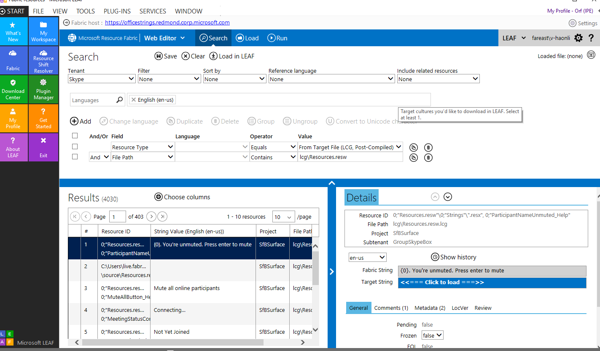

LEAF ImageViewer Reference
====================

**To develop a LEAF plugin, follow following steps**

1.	Create a class library, and within the project, a UserControl that implements IViewer or (IPlugin, IPluginInfo, IPluginHandler) should
be implemented.

2.	Use ResourcePane to access gridview in LEAF and hookup event handler to events in the gridview if needed

3.	In Build Events set cmd line as 
XCOPY *.dll "%LOCALAPPDATA%\MSLeaf\Plugins\Viewer\LEAF.Plugins.ImageViewer" /i /y
XCOPY *.xml "%LOCALAPPDATA%\MSLeaf\Plugins\Viewer\LEAF.Plugins.ImageViewer" /i /y
XCOPY *.exe "%LOCALAPPDATA%\MSLeaf\Plugins\Viewer\LEAF.Plugins.ImageViewer" /i /y

**To install a Plugin in Leaf, follow following steps**

1. Press **windows+R** and running %LOCALAPPDATA%\MSLeaf\Plugins\LEAF.Plugins.ImageViewer, copy .dll to this folder

2.	Create a config file such as LEAF.Plugins.ImageViewer.dll.config :
```xml
<configuration>
  <IViewer>
    <plugin type="LEAF.Plugins.ImageViewer.ImageViewer, LEAF.Plugins.ImageViewer" />
  </IViewer>
</configuration>
```

2.	Running LEAF, and in left side toolbox, use **PluginManager** and choose LEAF.Plugins.ImageViewer.dll.config so the plugin can load successfully.

**To query result for testing, follow following steps**
1. Running LEAF, and on left side toolbox, choose **Fabric**, Tenant choose Skype, add rules with FilePah - Contains- lcg\Resources.resw, and click Run.After gets result back, click **Load in LEAF**.

2. By clicking 3rd icon on right side toolbox, Find and Replace panel can be opened. Put Find in:Instruction, Find what:pactors. Then a resultset with pictures links can be fetched.

