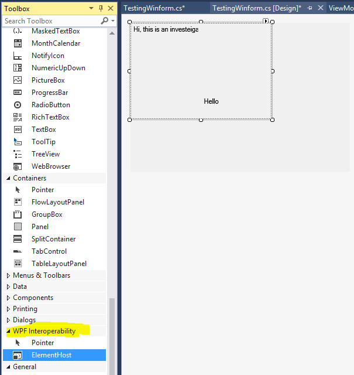
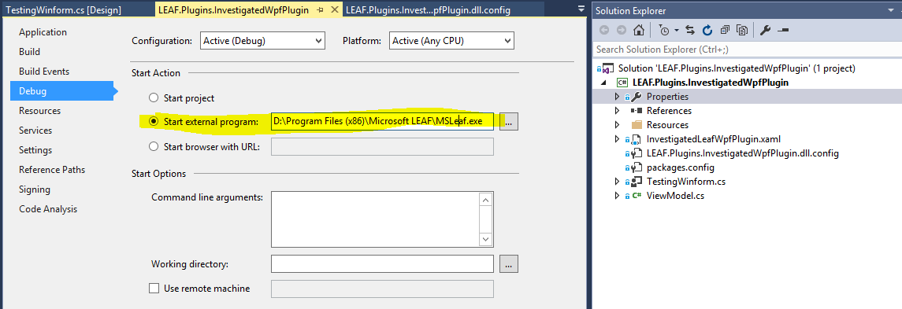

LEAF InvestigatedWpfPlugin Reference
====================

**To develop a LEAF plugin, follow following steps**

1.	Create a class library, and within the project, a WPF UserControl that implements IViewer or (IPlugin, IPluginInfo, IPluginHandler) should
be implemented.

2.  Create a window form user control,expand the WPF interoperability control tab from toolbox on the left, then drag the second control which is "ElementHost" and drop
it on the window form board, the next step is to select Hosted Content Like "InvestigatedLeafWpfPlugin" created from step1, finally don't forget to click the "Dock in 
parent container" to make the WPF UI filled perfectetly in the windowsform board.




3.	In Build Events set cmd line as 
XCOPY *.dll "%LOCALAPPDATA%\MSLeaf\Plugins\Viewer\LEAF.Plugins.InvestigatedWpfPlugin" /i /y
XCOPY *.xml "%LOCALAPPDATA%\MSLeaf\Plugins\Viewer\LEAF.Plugins.InvestigatedWpfPlugin" /i /y
XCOPY *.exe "%LOCALAPPDATA%\MSLeaf\Plugins\Viewer\LEAF.Plugins.InvestigatedWpfPlugin" /i /y
XCOPY *.config "%LOCALAPPDATA%\MSLeaf\Plugins\Viewer\LEAF.Plugins.InvestigatedWpfPlugin" /i /y

the purpose of this step is to copy all files with expected suffix into the MSleaf plugins folder

4. Don't forget to set starp project from exterbnal project "MSleaf.exe", cos the current plugin doesn't contain UI.
To find the start external program, firstly click property of the project, then click the 4th tab "Debug", last step is to choose the target option in the sction of "Start Action".




**To install a Plugin in Leaf, follow following steps**

1. Press **windows+R** and running %LOCALAPPDATA%\MSLeaf\Plugins\LEAF.Plugins.ImageViewer, copy .dll to this folder

2.	Create a config file such as LEAF.Plugins.InvestigatedWpfPlugin.dll.config :
```xml
<configuration>
  <IViewer>
    <plugin type="LEAF.Plugins.InvestigatedWpfPlugin.TestingWinform, LEAF.Plugins.InvestigatedWpfPlugin" />
  </IViewer>
</configuration>
```
Don't forget to set "copy always" to output directory.

2.	Running LEAF, and in left side toolbox, use **PluginManager** and choose LEAF.Plugins.InvestigatedWpfPlugin.dll.config so the plugin can load successfully.

**To check final effect of the plugged wpf control, follow following steps**

By clicking mushroom icon on right side toolbox, then a widowsform with wpf content control can be displayed.

