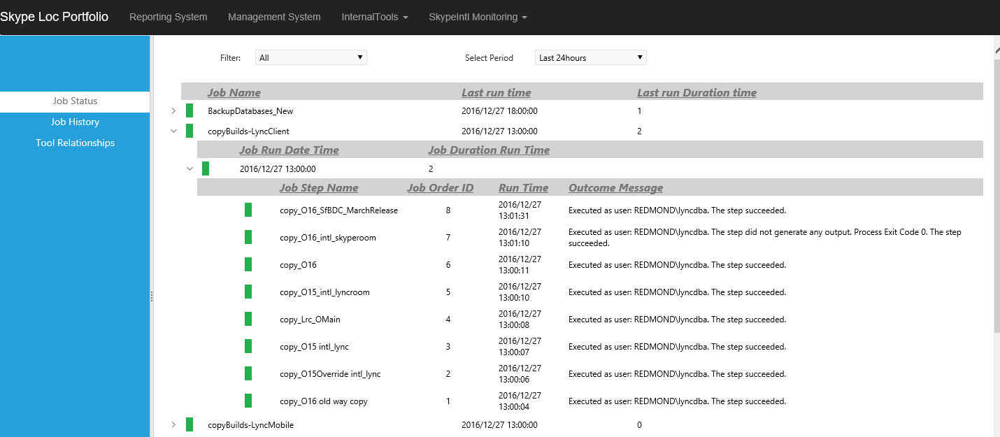
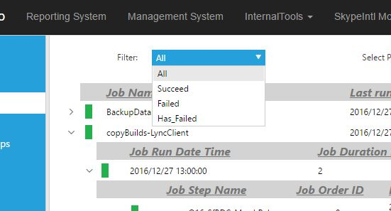
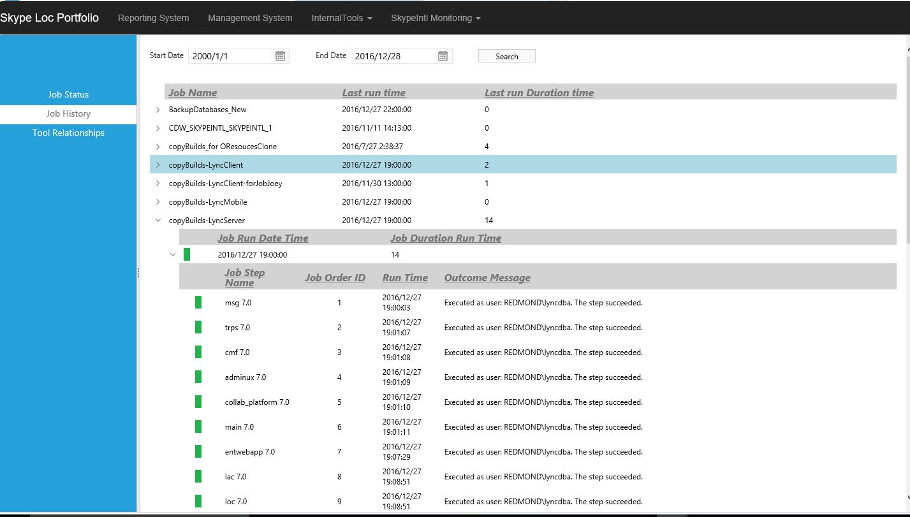


Usage of monitor page
=======

## Summary

>New monitor page is used to improve the use experience, we created new monitor page for jobs.

>New Monitor has three tabs:
>JobStatus tab: shows the latest status of jobs, help users can find the latest status of job and deal the issue immediately.
>JobHistory: shows all run records of jobs. User can review all information of jobs.
>Tools Jobs Relationship: shows the relationship between tools and jobs. User can find where are the tools be used very quickly in this page.
    
## Job Status

Job Status is a table with three levels. Such as below screenshot

Three Levels are: Job Level, Job run record Level, Job run detail Level.

**Job Level**: shows all jobs which has been run in selected period time.
Contains JobNames, JobLatestRunTime, JobLatestDurationRunTime.
And at the head of the column, use color to show different job status.
Green means all run records are past; Red means the latest run record is failed; Yellow means the latest run record is past but there are still have failed records before.
The color only shows the status during selected period time.

**Job run record Level**: shows all run records below to the job in selected time period.
Contains JobRunDateTime, JobDurationRunTime. This level shows each run record for the job.
And at the head of the column, use color to show run result of job.
Green means run result is past; Red means run result is failed; Yellow means unknown.

**Job run step details**: shows all steps under one job runing.
Contains StepRunStatus, JobStepName, JobStepID, RunDateTime, Failed_Outcome_Message. JobStepID shows the order of steps. 
And at the head of the column, use color to show run result of step.
Green means run result is past; Red means run result is failed; Yellow means unknown or retry.

**Status Filter:** To find out jobs with different status quickly, we can use status filter

The filter will give out all the job list during select time period.

**Period selected comboBox:** To select monitor time period. Once user select the time period, the data in tab will refresh automatically with new selected time period.

## Job History

Job History is a table with three levels. Such as below screenshot

Three Levels are: Job Level, Job run record Level, Job run detail Level.

**Job Level**: shows all jobs in system.
Contains JobNames, JobLatestRunTime, JobLatestDurationRunTime.

**Job run record Level**: shows all run records below to the job.
Contains JobRunDateTime, JobDurationRunTime. This level shows each run record for the job.
And at the head of the column, use color to show run result of job.
Green means run result is past; Red means run result is failed; Yellow means unknown.

**Job run step details**: shows all steps under one job running.
Contains StepRunStatus, JobStepName, JobStepID, RunDateTime, Failed_Outcome_Message. JobStepID shows the order of steps. 
And at the head of the column, use color to show run result of step.
Green means run result is past; Red means run result is failed; Yellow means unknown or retry.

Date Picker: To select monitor time period. Once user select the time period, the data in tab will refresh automatically with new selected time period.

## Tool Relationships

Tool Relationships shows relationship between tools and jobs. Such as below screenshot

Tab shows all the tools. Once click on any tool, all the jobs used this tool will be show under the tool's row.

Click at the job, the steps which steps are using the tool will be shown.

## Last Run Records

SQL Job Currently Running shows the running job when you visit the page. 

It can't refresh automatically, if you want to see current job, please click refresh button.

Last Run SQL Jobs In Period shows the steps running record in selected period.
First, the finished steps in the running jobs.
Second, if there are any jobs finished in the selected time period, shows all step for those jobs running records.

