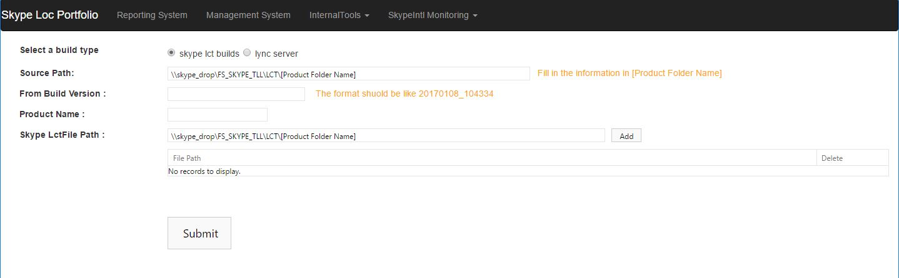
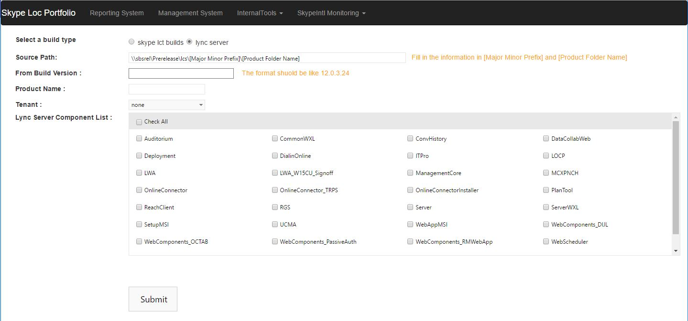
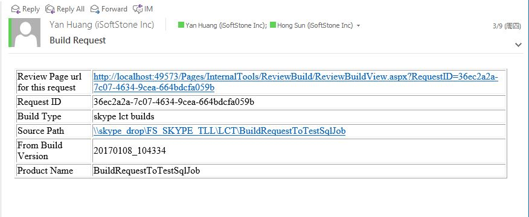
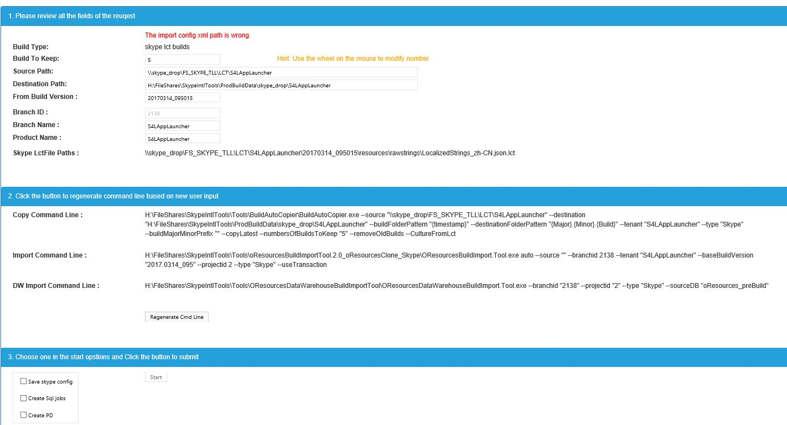


Usage of Request Build For PD page
=======

## Summary

>Request Build For PD page is used to create a PD request .

>Request Build For PD page includes two parts: Request page and Review page. normal user can visit Request page, and only PD admin can know the link of Review page.

    
## Request page

Request page url is http://skypeintl/portfolio/Pages/InternalTools/RequestBuild/RequestBuildView.aspx

It's contains 2 types of requests: **skype lct builds** and **lync server**
User can switch between them by selecting different build type

**skype lct builds** : 

User need to select/input:  build type; Source Path; From Build Version; Product Name; Skype LctFile Path
Then click submit button.

**lync server**: 

User need to select/input:  build type; Source Path; From Build Version; Product Name; Tenant;Lync Server Component List
Then click submit button.

## Review Page

Review page's link will send in a email. Only to the people who need to review it.
Such like followed image 

After admin click the link, they will be redirect to skype or lync server review page.

**skype lct builds** : 

Admin can see the request detail in the page. Followed the work follow in with PD. Admin can add branchId; add config in config file and add step in Job. 

**lync server**: 

Admin can see the request detail in the page. Followed the work follow in with PD. Admin can add branchId and add step in Job.