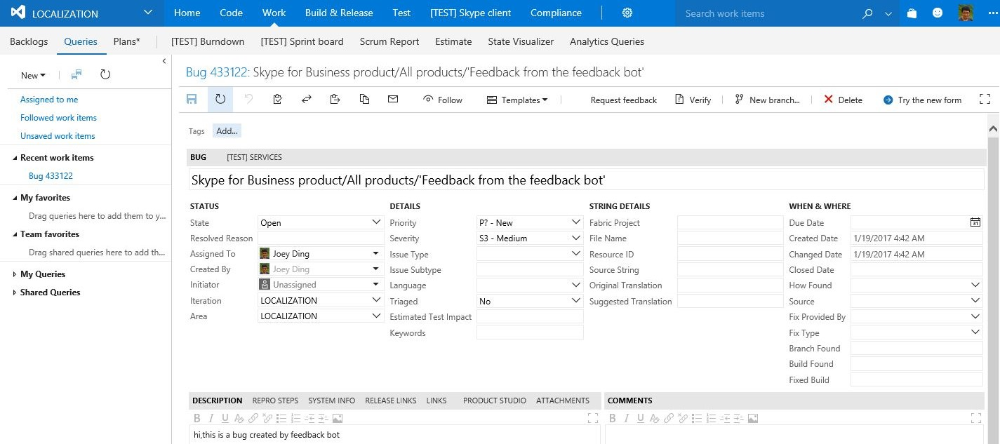

# User Manual

## **What is this Feedback Bot for?**

This bot can provide feedback about the quality of localized Skype software or content

## **How to use it?**
 
*User*: "log feedback"

*User*: "provide feedback"
		
*Bot*: Hi, I understand you have feedback for the localization team today. May I ask what language this is in?
		
*User* provides a language from the form contains different languages
 		     
*User*: Great, thanks. Is this feedback for a Consumer or the Skype for Business product?
		
*User* provides consumer or Skype for Business

			   
*Bot*：Thank you. Now, can you tell me the specific product this is for, or is it generic?

*User* provides a product name (does not need to match up with current product list)
			   
*Bot*：Thank you! Ok, please enter your feedback when ready. 
		
*User* Enters feedback text
         
*Bot*：You can provide screenshots or attachments if you have them. The more detail, the easier it is to fix!
    
*User* Adds attachments to the chat
			   
*Bot*：Feedback received! Generating a work item Now...
       Your feedback has been logged - work item [VSO link](https://skype-test2.visualstudio.com/DefaultCollection/LOCALIZATION/_workitems/edit/433141) has been created, 
       and will be triaged and actioned as soon as possible.Thanks for using Feedback Bot. Would you like to provide more feedback?

*User*：Yes/No

*Bot*：If yes, restart loop,if no, quit the loop.

## **How does the created feedback(BugItem) look like in VSO?**

*VSO Bug Title*：Product voice/product name/ "Feedback from the Feedback Bot".

*VSO Bug Description*： Feedback text from user's input.

*VSO Bug Attachment*： Attachment can accept pdf/image/word document...

*VSO Bug CreatedDate*： Date of when the feedback was generated.

*Created link sample*： [VSO link](https://skype-test2.visualstudio.com/DefaultCollection/LOCALIZATION/_workitems/edit/433141)

##Issues might happened during deployment##

405 MethodNotAllowed when testing a Bot from the Emulator

solution

The issue was that the Bot Url was going to the root directory and in the root directory of the solution there is a default.htm file which cannot handle a POST.

The fix was to update the Bot Url to include /api/messages so that the request went to the controller instead of the default.htm file, as shown in Figure 2.

